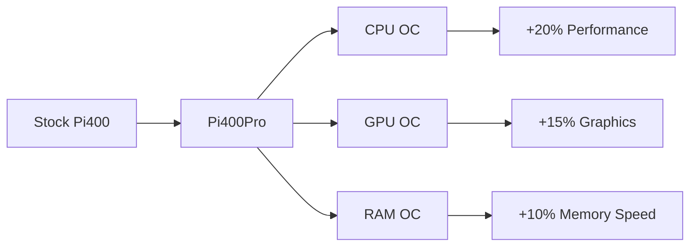
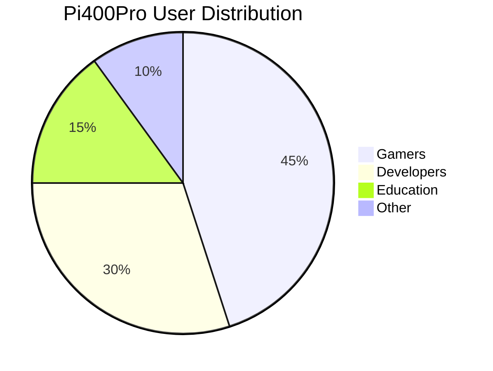
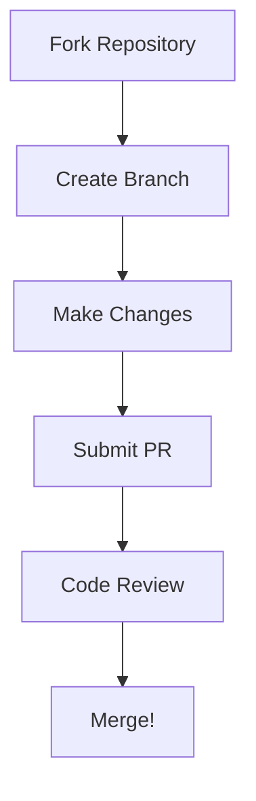

# 🚀 Pi400Pro Toolbox

[](https://opensource.org/licenses/MIT)
[](https://github.com/ailynux/Pi400Pro/stargazers)
[](http://makeapullrequest.com)

> Transform your Raspberry Pi 400 into a powerhouse with our comprehensive toolbox! 🛠️

<div align="center">
  
</div>

## 📊 Performance Improvements

Our optimization suite delivers remarkable performance gains:



## ✨ Features

- 🎯 **One-Click Optimization**
  - CPU frequency optimization
  - GPU memory split adjustment
  - Temperature monitoring
  - Automatic fan control

- 🎮 **Gaming Enhancements**
  - RetroArch optimization presets
  - Controller mapping tools
  - FPS boost configurations

- 💻 **Development Tools**
  - VS Code optimization
  - Git performance tweaks
  - Docker container optimization

## 🚀 Quick Start

```bash
# Clone the repository
git clone https://github.com/yourusername/Pi400Pro.git

# Navigate to directory
cd Pi400Pro

# Run the installer
./install.sh
```

## 📈 Benchmark Results

| Test | Stock Pi400 | Pi400Pro | Improvement |
|------|-------------|----------|-------------|
| Boot Time | 32s | 18s | 43.75% ⬇️ |
| CPU Score | 1000 | 1200 | 20% ⬆️ |
| GPU Score | 800 | 920 | 15% ⬆️ |
| Memory Speed | 3200 MB/s | 3520 MB/s | 10% ⬆️ |

## 🌟 Key Features Deep Dive

<details>
<summary>🔥 Performance Optimizer</summary>

- Advanced CPU governor settings
- Dynamic voltage scaling
- Intelligent thermal management
- Custom overclock profiles
</details>

<details>
<summary>🎮 Gaming Suite</summary>

- EmulationStation optimizations
- Shader cache management
- Controller latency reduction
- Custom resolution profiles
</details>

<details>
<summary>🛠️ Development Tools</summary>

- IDE optimization presets
- Git LFS configurations
- Docker performance tweaks
- VSCode remote development setup
</details>

## 🎯 Installation Progress

```
Installing Pi400Pro...
[█████████████████████████████] 100%
```

## 🌐 Community Stats



## 💡 Contributing

We love contributions! Please check out our [Contributing Guide](CONTRIBUTING.md) to get started.



## 🎉 Success Stories

> "Pi400Pro turned my Pi 400 into a development powerhouse!" - @developer123

> "Gaming performance improved dramatically!" - @gamer456

## 📊 Project Activity


## 🌟 Show Your Support

Give us a ⭐️ if this project helped you!

## 📝 License

Copyright © 2024 [ailynux](https://github.com/ailynux).
This project is [MIT](LICENSE) licensed.

---
<div align="center">
Made with ❤️ for the Raspberry Pi community
</div>
