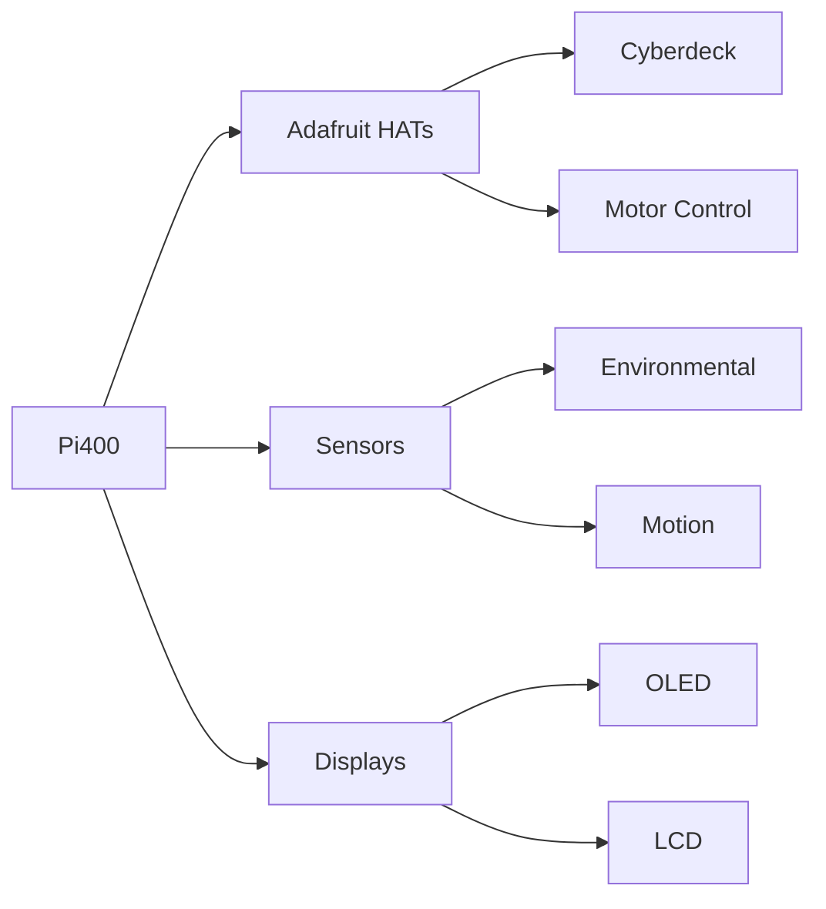
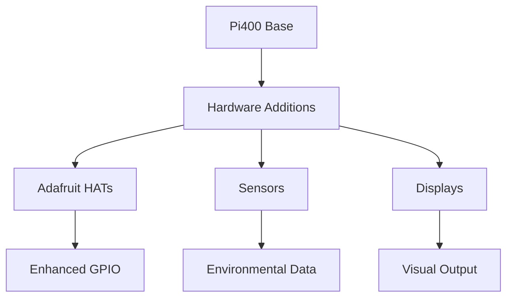
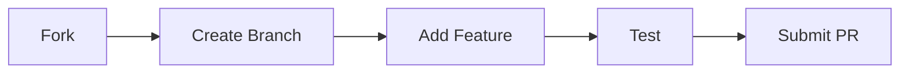

#  Pi400Pro Toolbox: Maker's Edition 


<div align="center">
  
[](https://opensource.org/licenses/MIT)
[](https://github.com/ailynux/Pi400Pro/stargazers)
[](http://makeapullrequest.com)
[](https://www.adafruit.com/)
[](https://www.python.org/downloads/)
[](https://circuitpython.org/)

</div>

<div align="center">
  <h3> Transform Your Raspberry Pi 400 into an Advanced Maker Station </h3>
  <p><em>Featuring Adafruit Hardware Integration, Advanced Python Tools, and Maker-Ready Components</em></p>
</div>

---

<div align="center">
  
  
</div>

## 🌟 Featured Hardware Support

### Adafruit Integration

<div style="display: flex; align-items: center; justify-content: space-between;">
  
  <div>
    
[](https://opensource.org/licenses/MIT)
[](https://github.com/ailynux/Pi400Pro/stargazers)
[](http://makeapullrequest.com)
[](https://www.adafruit.com/)
  </div>
</div>

> Transform your Raspberry Pi 400 into the ultimate maker station with Adafruit hardware integrations and powerful development tools! 🛠️

## 🌟 Featured Adafruit Integration

### Supported Hardware
- 🎩 **Cyberdeck HATs & Bonnets**
  - Display-O-Tron HAT
  - RTC HAT
  - Servo/PWM HAT
  - Mini PiTFT
    


 
- 🔧 **Sensors & Components**
  - BME680 Environmental Sensor
  - NeoPixel strips
  - STEMMA QT sensors
  - Motor controllers

### Pre-configured Libraries
```python
# Quick start with Adafruit components
from adafruit_motorkit import MotorKit
from adafruit_servokit import ServoKit
from adafruit_bme680 import BME680

# Initialize your hardware
kit = MotorKit()
servo = ServoKit(channels=16)
sensor = BME680()
```

## 🚀 Maker's Feature Set

### Hardware Optimization
- ⚡ Advanced CPU/GPU overclocking profiles
- 🌡️ Temperature monitoring with Adafruit BME680
- 🎮 GPIO optimization for HATs and Bonnets
- 💻 Display configuration for various Adafruit screens

### Development Environment
- 🐍 Python development toolkit
  - Pre-configured CircuitPython support
  - Adafruit_Blinka library integration
  - Auto-detection of I2C devices
- 🔧 Hardware testing suite
  - GPIO pin testing
  - I2C device scanning
  - PWM signal verification

### Example Projects
```python
# Control NeoPixels with patterns
import board
import neopixel
from time import sleep

pixels = neopixel.NeoPixel(board.D18, 30)

def rainbow_cycle(wait):
    for j in range(255):
        for i in range(30):
            pixel_index = (i * 256 // 30) + j
            pixels[i] = wheel(pixel_index & 255)
        pixels.show()
        sleep(wait)
```

## 📊 Hardware Performance Suite



## 🛠️ Quick Start Guide

```bash
# Clone the repository
git clone https://github.com/ailynux/Pi400Pro.git

# Install dependencies
pip3 install -r requirements.txt

# Run the hardware detection
python3 setup.py --scan-hardware

# Launch the configuration UI
python3 configure.py
```

## 🔧 Project Examples

### Environmental Monitor
```python
import time
import board
from adafruit_bme680 import BME680

i2c = board.I2C()
sensor = BME680(i2c)

while True:
    print(f"Temperature: {sensor.temperature}°C")
    print(f"Humidity: {sensor.humidity}%")
    print(f"Pressure: {sensor.pressure}hPa")
    print(f"Gas: {sensor.gas}Ω")
    time.sleep(1)
```

### LED Matrix Display
```python
from adafruit_ht16k33.matrix import Matrix8x8
import board
import time

i2c = board.I2C()
matrix = Matrix8x8(i2c)

# Display a heart pattern
matrix.fill(0)
pattern = [
    [0,1,1,0,0,1,1,0],
    [1,1,1,1,1,1,1,1],
    [1,1,1,1,1,1,1,1],
    [1,1,1,1,1,1,1,1],
    [0,1,1,1,1,1,1,0],
    [0,0,1,1,1,1,0,0],
    [0,0,0,1,1,0,0,0],
    [0,0,0,0,0,0,0,0]
]
matrix.matrix = pattern
```

## 📚 Documentation

- [Hardware Setup Guide](docs/HARDWARE.md)
- [Software Configuration](docs/SOFTWARE.md)
- [Adafruit Integration Guide](docs/ADAFRUIT.md)
- [Project Examples](docs/EXAMPLES.md)
- [Troubleshooting](docs/TROUBLESHOOTING.md)


## 🤝 Contributing

We welcome contributions! Check out our [Contributing Guide](CONTRIBUTING.md).



## 📝 License

Copyright © 2024 [ailynux](https://github.com/ailynux).
This project is [MIT](LICENSE) licensed.

## 📬 Contact Me

If you'd like to connect, feel free to reach out through my website or LinkedIn. I'm always open to collaborations and discussions!

<div align="center">
    <a href="https://ailynux.github.io/" target="_blank">
        
    </a>
    <a href="https://www.linkedin.com/in/ailyndiaz01" target="_blank">
        
    </a>
</div>

---
<div align="center">
  
  <h2>✨ Made with 💜 for the Raspberry Pi & Adafruit Community ✨</h2>
  <br>

  
  
  <p>
    <b>🌍 Connect • 💡 Learn • 🚀 Innovate</b>
  </p>
  
  <h4>🌌 "Empowering Creativity, One Pi at a Time" 🌌</h4>

  <br>
  
  <p>Star it ⭐ on GitHub</p>

</div>

